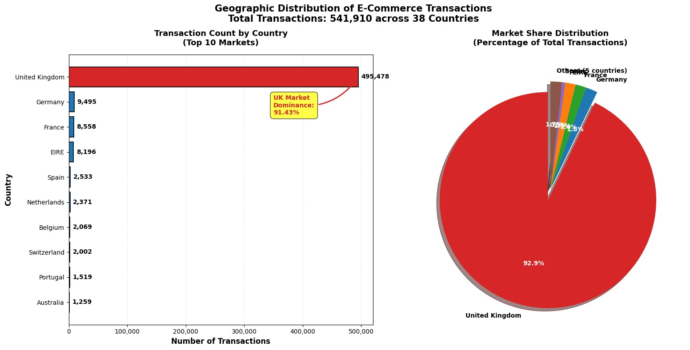
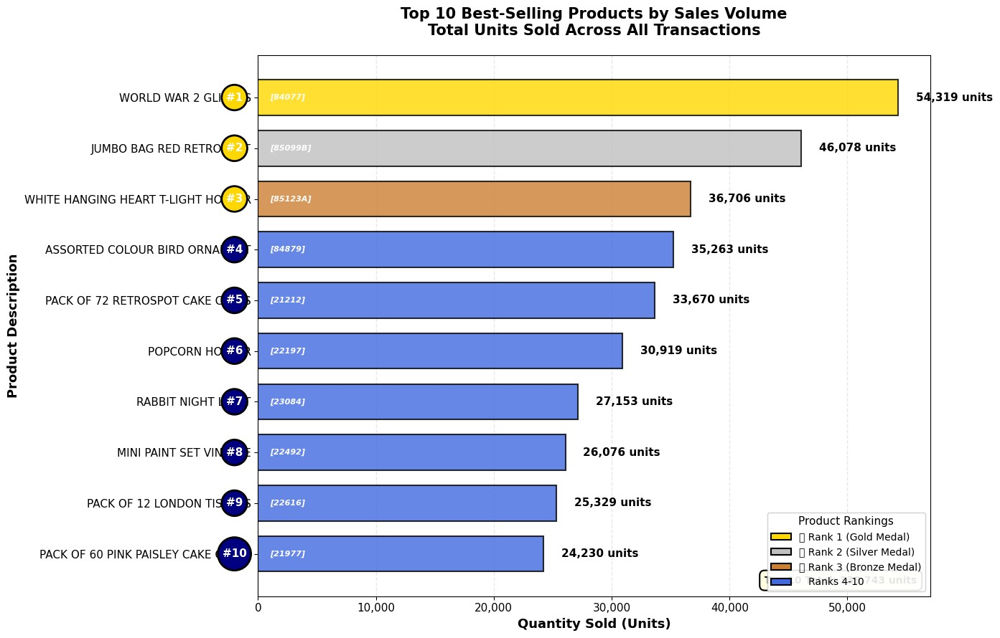

# 📦 Big Data E-Commerce Analytics Pipeline

An end-to-end **big data pipeline** built with **PySpark**, implementing a **Bronze → Silver → Gold medallion architecture** to transform raw e-commerce transaction data (541,910 records, 38 countries, Dec 2010–Dec 2011) into analytics-ready datasets served through **MongoDB Atlas**.

> 📄 Full methodology — business context, data quality process, feature engineering, MongoDB schema design and indexing strategy, performance optimization, and lessons learned — is documented in the [complete project report](docs/Technical report.pdf).

**GitHub Repository:** [bigdata-ecommerce-pipeline](https://github.com/DewmiAbeyoon/bigdata-ecommerce-pipeline)  
**Author:** Dewmi Abeyoon

## 📁 Project Structure

```
bigdata-ecommerce-pipeline/
├── app.py                          # Streamlit dashboard for analytics
├── data_loader.py                  # Data loading utilities
├── run_pipeline.py                 # Main pipeline orchestration script
├── requirements.txt                # Python dependencies
├── README.md                        # This file
├── LICENSE                          # MIT License
├── .gitignore                       # Git ignore rules
│
├── src/                             # Pipeline implementation modules
│   ├── config.py                   # Spark session & MongoDB connection setup
│   ├── bronze_layer.py             # Raw data ingestion & partitioning
│   ├── silver_layer.py             # Data cleaning & quality validation
│   ├── gold_layer.py               # Feature engineering & aggregations
│   └── mongo_loader.py             # MongoDB collection loading
│
├── notebooks/                       # Jupyter notebooks
│   └── Big_Data_Pipeline.ipynb     # Exploratory analysis & pipeline notebook
│
├── docs/                            # Documentation & reports
│   ├── Final_Report.pdf            # Complete project report
│   └── screenshots/                # Architecture & analytics visualizations
│       ├── big_data_pipeline_architecture.jpeg
│       ├── report_geographic_distribution.jpg
│       └── report_top_products.jpg
│
└── sample_data/                     # Sample data for demo mode
    └── demo_data.json              # Sample dataset for Streamlit dashboard
```

## 🏗️ Pipeline Architecture


**Pipeline notebook (exploratory):** [`notebooks/Big_Data_Pipeline.ipynb`](notebooks/Big_Data_Pipeline.ipynb)
**Pipeline scripts (production-style, runnable):** [`src/`](src/) + [`run_pipeline.py`](run_pipeline.py)

The notebook was used for exploration and analysis (see the charts and query results below). The same logic is also implemented as standalone, modular `.py` scripts so the pipeline can be run outside Colab as a normal Python job:

```bash
pip install -r requirements.txt

export MONGO_USERNAME="your_username"
export MONGO_PASSWORD="your_password"
export MONGO_CLUSTER="your_cluster.mongodb.net"
export MONGO_DATABASE="your_database"

# Run the full pipeline: Bronze -> Silver -> Gold -> MongoDB
python run_pipeline.py --csv data/online_retail.csv

# Or run a single stage
python run_pipeline.py --csv data/online_retail.csv --stage bronze
python run_pipeline.py --stage silver
python run_pipeline.py --stage gold
python run_pipeline.py --stage mongo
```

```
src/
├── config.py         # Spark session + MongoDB connection setup
├── bronze_layer.py   # Raw ingestion, type correction, partitioning
├── silver_layer.py   # 7-step data cleaning + quality report
├── gold_layer.py      # Feature engineering (Revenue, RFM inputs, window functions)
└── mongo_loader.py    # Builds & writes fact_invoices / dim_customers / dim_products
```

### Bronze Layer — Raw Ingestion
Loads the raw CSV into Spark, corrects data types (`InvoiceDate` → timestamp), and writes partitioned Parquet (by Year/Month).

### Silver Layer — Data Cleaning
Seven-step quality process: removes null Customer IDs, filters cancelled invoices, removes invalid prices, flags returns, drops duplicates, handles quantity outliers, removes null descriptions. Produces a full data quality report.

### Gold Layer — Feature Engineering
Computes Revenue, time-based features (hour/day/month), basket size, and RFM (Recency, Frequency, Monetary) metrics, then loads the results into three MongoDB collections.

## 🧱 MongoDB Collections (Pipeline Output)

| Collection | Documents | Purpose | Key Fields |
|---|---|---|---|
| `fact_invoices` | 18,530 | Transaction-level analysis | `invoice_id`, `customer_id`, `line_items[]` |
| `dim_customers` | 4,337 | Customer / RFM segmentation | `customer_id`, `recency`, `frequency`, `monetary` |
| `dim_products` | 3,896 | Product performance | `stock_code`, `total_quantity_sold`, `country_sales[]` |

Indexes: `fact_invoices.customer_id`, `fact_invoices.invoice_date`, `dim_customers.total_revenue` (desc), `dim_products.total_revenue` (desc).

## 🔄 Micro-Batch Ingestion Simulation (Incremental Pipeline)

To demonstrate how the pipeline handles continuous, real-world data flow (incremental updates):

* **Monthly Chunking:** Splits the Bronze dataset into monthly batches (`Year` & `Month`).
* **Sequential Processing:** Iterates through batches to execute Bronze extraction, Silver cleaning rules, and Gold feature engineering (Revenue, Basket Size, Time features).
* **Incremental MongoDB Load:** Uses PyMongo's `insert_many` in **append mode** to load invoice-level aggregations into `fact_invoices_incremental` without overwriting historical documents.
* **Latency & Metric Logging:** Tracks extraction time, cleaning time, load time, and row counts per batch, outputting performance metrics to `micro_batch/logs/batch_processing_metrics.csv`.
## 📊 Analytics Results (from the pipeline)

<table>
<tr>
<td></td>
<td></td>
</tr>
<tr>
<td align="center"><sub>Geographic distribution of transactions</sub></td>
<td align="center"><sub>Top 10 best-selling products</sub></td>
</tr>
</table>

Ten analytical queries validate the Gold layer output — five via Spark SQL, five via MongoDB aggregation pipelines — covering monthly revenue trends, top customers, product performance, geographic markets, and return patterns. Full results and business insights are in the [project report](docs/Technical report.pdf).

## 🖥️ Deliverables

This repo contains three deliverables built on top of the pipeline:

1. **The pipeline itself** — [`notebooks/Big_Data_Pipeline.ipynb`](notebooks/Big_Data_Pipeline.ipynb) (PySpark, Bronze/Silver/Gold, MongoDB load)
2. **A Streamlit dashboard** — [`app.py`](app.py), a lightweight consumption layer over the Gold-layer MongoDB collections, for exploring pipeline output interactively (see below)
3. **The written report** — [`docs/Technical report.pdf`](docs/Final_Report.pdf), covering methodology and analytics results in full

### Analytics Dashboard (optional add-on)

`app.py` is a small Streamlit app that queries the `fact_invoices` / `dim_customers` / `dim_products` collections directly, so pipeline output can be explored without re-running the notebook:

- **Executive Overview** — Total Revenue, Total Orders, Active Customers, Avg. Order Value, monthly revenue trend, top products
- **Geographic Analytics** — transaction volume and market share by country
- **Data Explorer** — search any Customer ID or Invoice ID and inspect the full aggregated record

```bash
pip install -r requirements.txt
streamlit run app.py
```

It runs in **demo mode** out of the box (bundled sample data grounded in the report's real figures), or connects live if MongoDB credentials are set:

```bash
export MONGO_USERNAME="your_username"
export MONGO_PASSWORD="your_password"
export MONGO_CLUSTER="your_cluster.mongodb.net"
export MONGO_DATABASE="your_database"
```

## 🛠️ Tech Stack

- **Processing:** PySpark (Bronze/Silver/Gold medallion architecture)
- **Storage:** Parquet (partitioned by Year/Month) + MongoDB Atlas
- **Dashboard:** Streamlit, Plotly, Pandas, PyMongo
- **Environment:** Google Colab

## 🔭 Future Improvements

- **Batch Pipeline Monitor** — an operational view surfacing pipeline run history: micro-batch ingestion timestamps, records processed per run, extract/load durations, and failure alerts. Deferred from this release since it's an operational/monitoring concern rather than a core pipeline output, but valuable for demonstrating production data-engineering practices.
- Choropleth map for geographic analytics (in place of the current bar chart).
- Customer RFM segmentation view (High-Value / At-Risk / Churned) on top of existing `dim_customers` metrics.
- Scheduled/automated Gold → MongoDB refresh instead of manual notebook runs.
- Migrate off Colab-specific dependencies (`google.colab.userdata`, Drive mounting) for portability.

## 📜 Author and Repository

**GitHub Repository:** [bigdata-ecommerce-pipeline](https://github.com/DewmiAbeyoon/bigdata-ecommerce-pipeline)  
**Author:** Dewmi Abeyoon